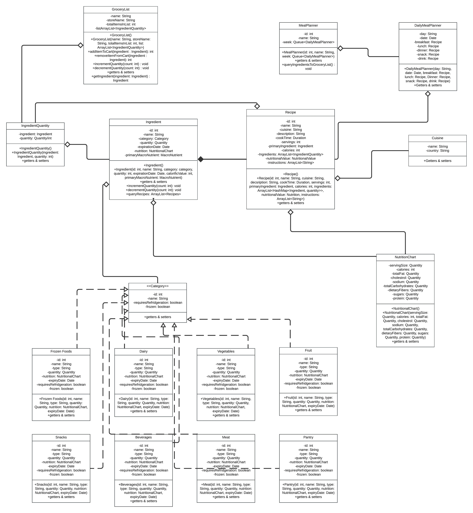

# Architecture

The diagram below shows all the classes, interfaces, their methods and variables.

The list of classes:
+ Ingredient
+ Recipe
+ IngredientQuantity
+ GroceryList
+ MealPlanner
+ DailyMealPlanner
+ Cuisine
+ NutritionalChart
+ Frozen food
+ Dairy
+ Vegetable
+ Fruit
+ Snack
+ Beverage
+ Meat
+ Pantry

The list of Interfaces:

- Category

(Point out any Grammatical mistakes in the diagram by writing a comment in this file.)

The relationships between the classes are represented by the solid and dotted arrows according to standard UML. 

