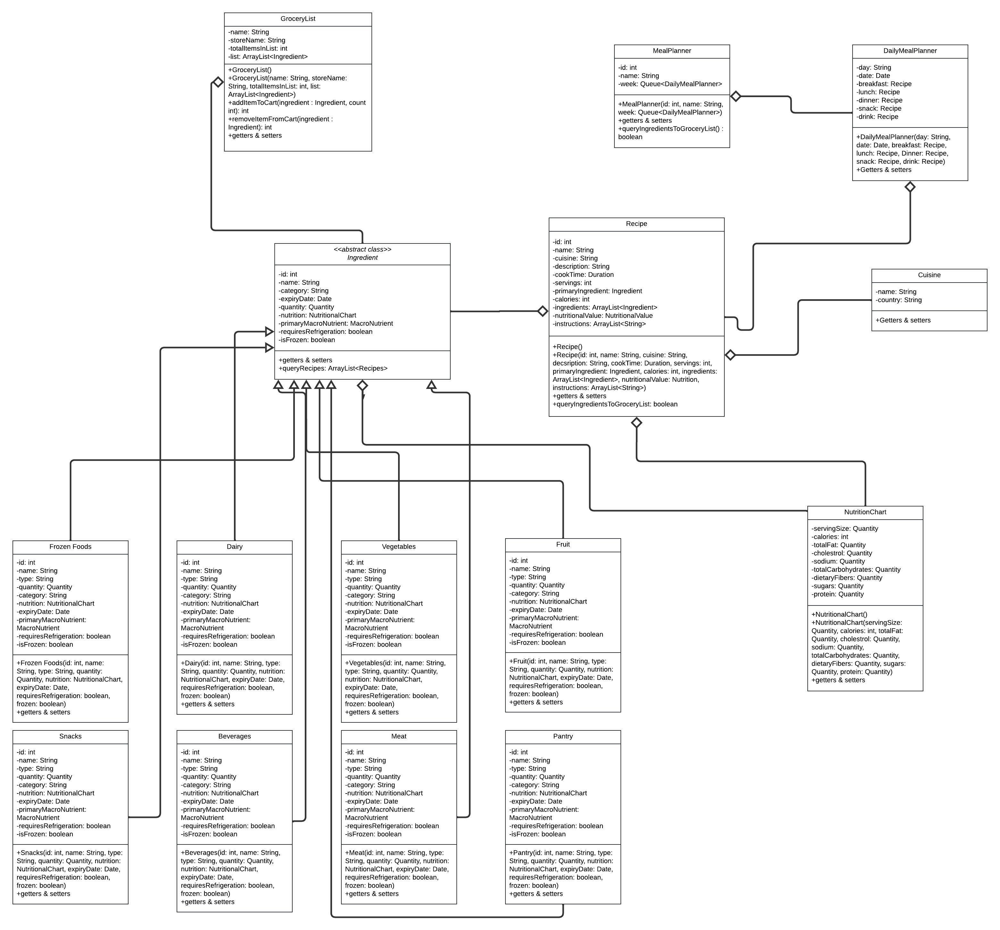

# Architecture

The diagram below shows all the classes, interfaces, their methods and variables.

### The list of classes:

+ Recipe
+ GroceryList
+ MealPlanner
+ DailyMealPlanner
+ Cuisine
+ NutritionalChart
+ Frozen food
+ Dairy
+ Vegetable
+ Fruit
+ Snack
+ Beverage
+ Meat
+ Pantry

### The list of abstract classes:

- Ingredient

## The interactions between classes:

- The Ingredient abstract class is extended by FrozenFood, Dairy, Vegetable, Fruit, Snack, Beverage, Meat and Pantry classes. They inherit all the instance variables and methods of the parent class.
- The Ingredient class has-a NutritionalChart to represent the nutrition value of each ingredient.
- The GroceryList class has-a Ingredient. This means that any of the subclasses that inherit from Ingredients can take the place in the ArrayList inside GroceryList.
- The Recipe class has-a Ingredient to represent the list of ingredients for a recipe in the form of an ArrayList.
- The Recipe class has-a NutritionalChart to represent the nutritional value of each recipe.
- The Recipe class has-a Cuisine to represent the cuisine.(Further data might be added to cuisine class).
- The DailyMealPlanner class has-a Recipe to represent each meal of the day.
- The MealPlanner class has-a DailyMealPlanner in the form of a Queue to form a week/month of meals planned.

## UML Class Diagram

The relationships between the classes are represented according to standard UML. 

## MVC Sequence Diagram

We selected our hardest functional requirement to represent which is determining which items are missing from a recipe. 

## UML Class Diagram with MVC Architecture
