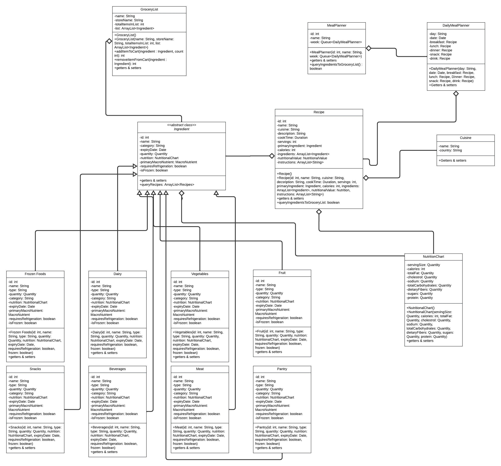

# Entities

## Grocery List

The purpose of the grocery list is to store and display a list of needed items for your recipes.

## Ingredients 

The purpose of the ingredients is to store the quantity of what you have in your pantry

## Recipe

The purpose of recipe is to store recipes for use in the future. And it will check with ingredients to see what is needed for the grocery list.

## Meal Planner

Uses Recipes to meal plan.

## Nutrition Chart

Keeps track of the nutritional values of ingredients and recipes to aid in the meal planning process.

## Category

Will display what food groups an ingredient belongs to.

