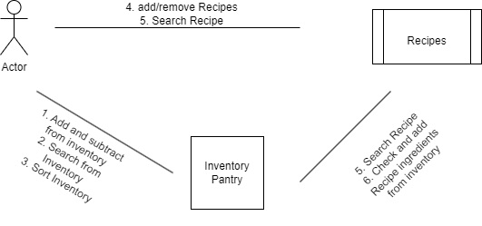

# Application Specification

## Problem Statement
It is very ineffective and disorganized when you go to make a meal and do not know all ingredients in your kitchen.
Our application aims to simplify the process by allowing the user to create a list of the things that they have in their 
kitchen and compare this to the ingredients required to make a dish. This will hopefully save the user time and create a 
more organized kitchen environment.

## Functional Requirements

1. Add and Subtract from Inventory
2. Search from Inventory
3. Sort Inventory
4. Add Remove Recipe
5. Search Recipe
6. Check and add Recipe ingredients with Inventory

## Non-functional

1. Data Retention
2. Reusability
3. Extensibility

## Use Case Diagram

