# Wireframes

## Home Screen

This is the main screen that will steer the user into different views.

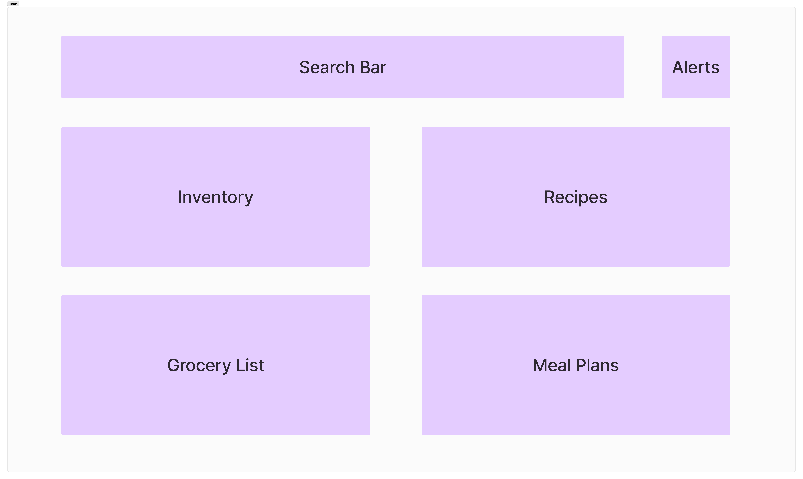

## Inventory Main Screen

This is the first view that the user sees when pressing on inventory from the main screen. You can see all the
food that is currently in your kitchen. Each Item is split into different categories including name, expr date, and the 
quantity. If you are looking for a specific item you can search. You can also go back to the main screen using the back 
button in the top left corner.

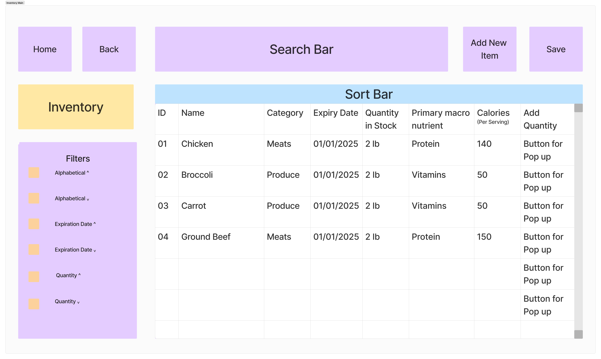

## Ingredient Pop Up Screen

This is the screen that the user will see upon pressing on an item in the inventory. This includes information about 
the item like macronutrients, what is tastes like, and a picture. This screen also allows gives you a link to update the 
quantity.

## Edit Quantity Screen

This is the screen that will display after pressing edit inventory screen. It then asks if you would like to add 
your current inventory, or your grocery list. 

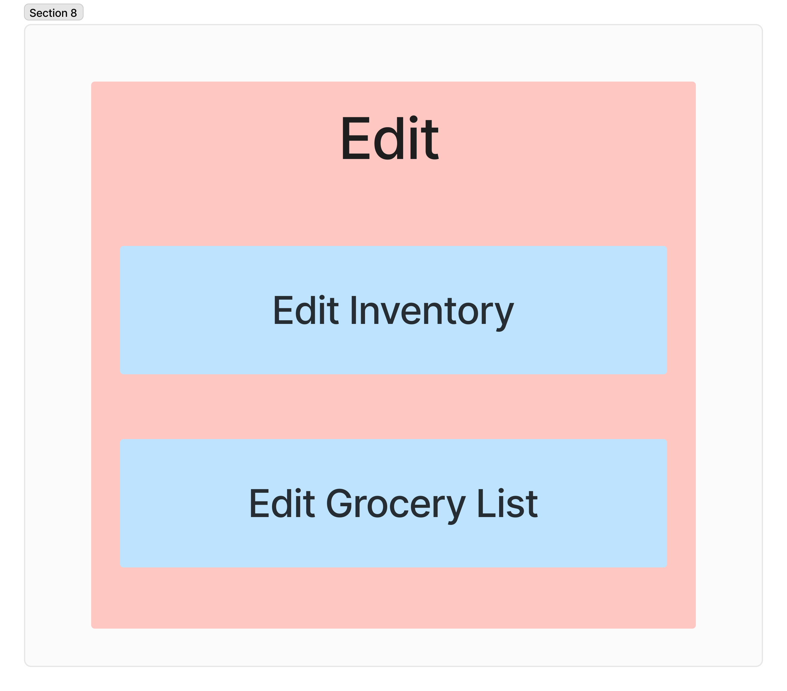

## Edit Inventory Screen

This is the screen that will allow you to edit the inventory of the selected item.

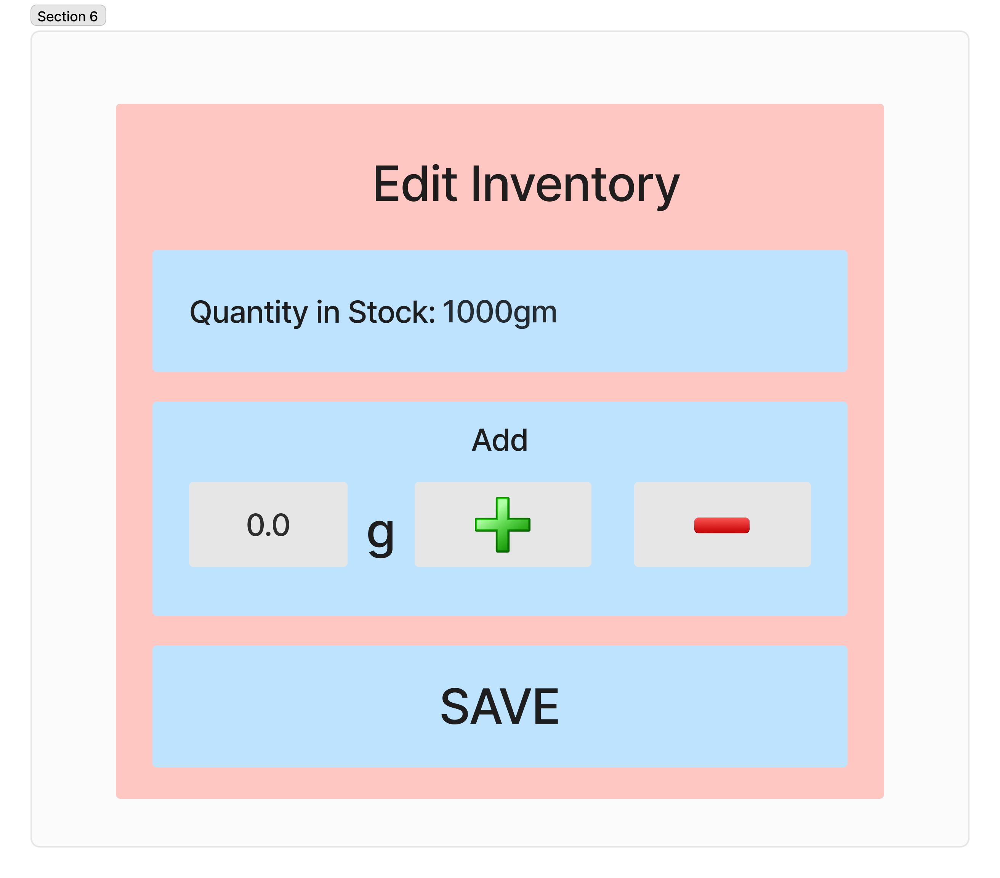

## Edit Grocery List Screen

This is the screen that will allow you to edit the grocery list quantity of the selected item.

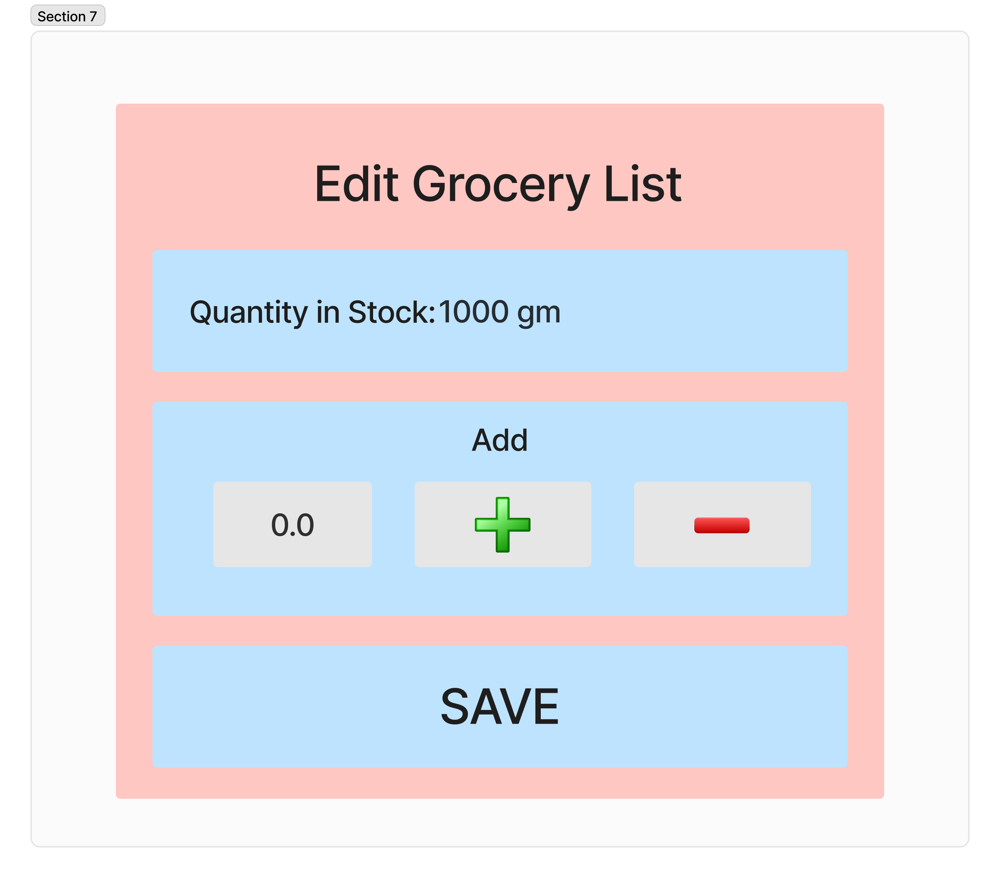

## Recipes Screen

This is the screen that displays the current recipes that are in the database. From here you are able to search through 
recipes using the search bar and the filter bar. You can also create a new recipes using the Add New Recipe button.

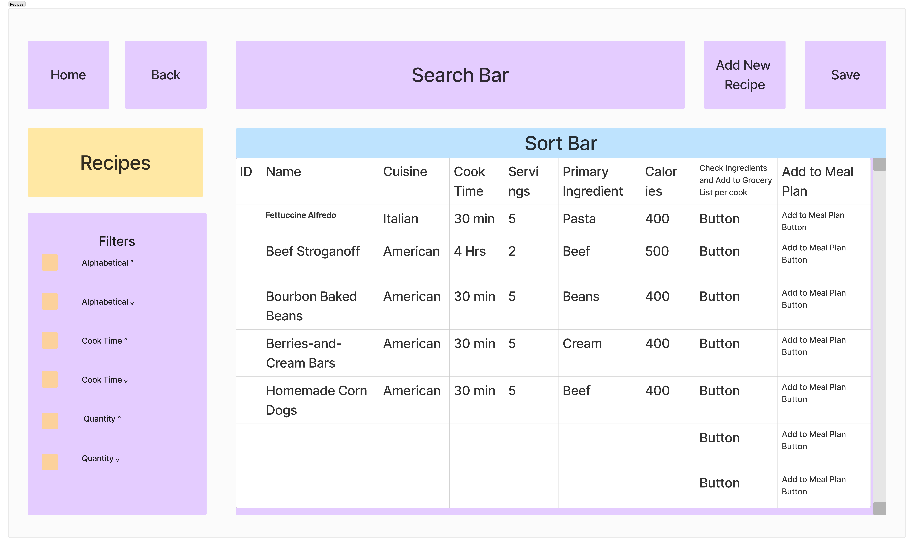

## Recipe Pop Up Screen

This is the screen that will display the recipe that you had selected on the previous screen. You will be able to see
the ingredients that you need and whether they are missing or not. It will also display the steps and nutritional value
for the meal. 

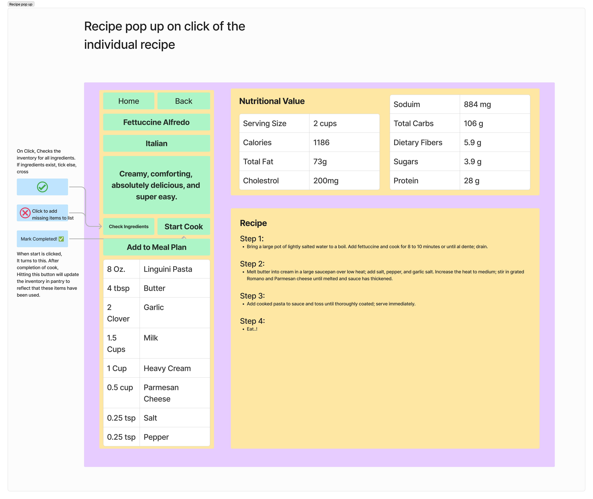

## Add a New Recipe Screen

This screen allows you to fill in missing information to create your own recipe.

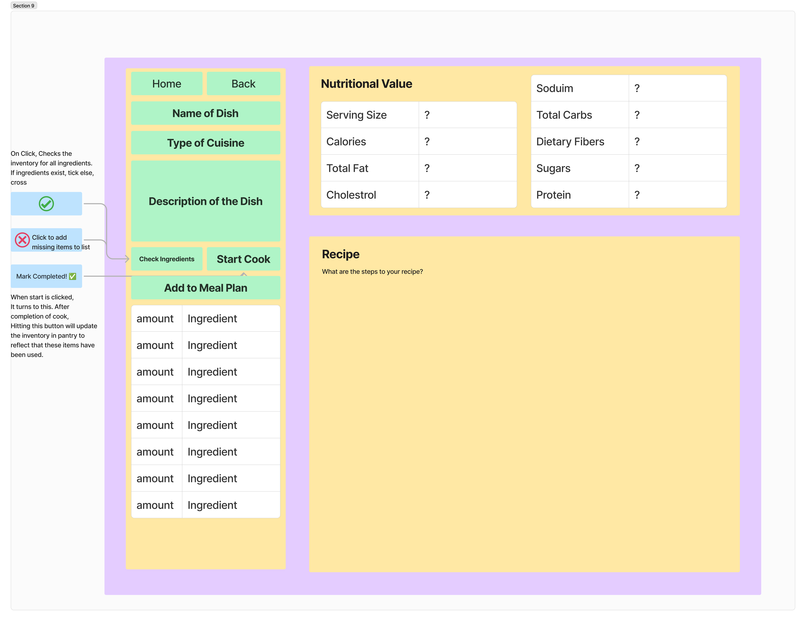

## Grocery List Screen 

This is the screen that will display what is currently in your grocery list. Similar to other screen in layout. 

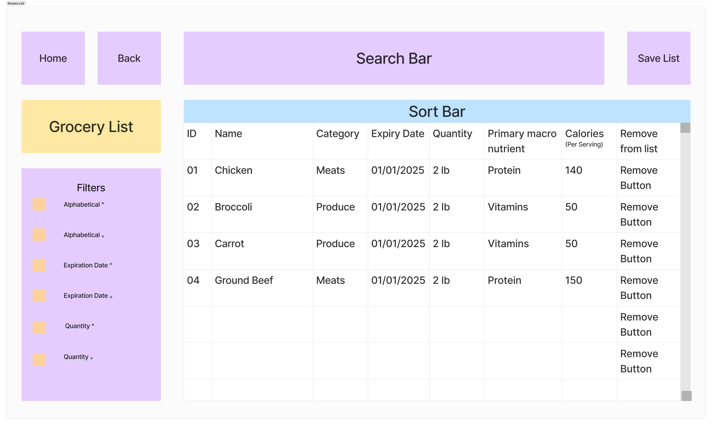

## Meal Plan Screen

This screen displays the meal plans that you currently have.

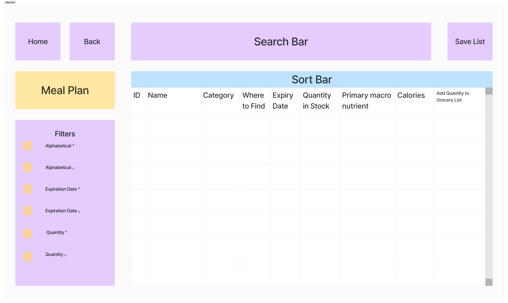

## Meal Plan Calender

This is where you will go to plan out your next 2 weeks of meals.
You will also be able to select shopping list to see ingredients you will need for the next week.
When you hit add meal it will show you the MealPlan.jpg

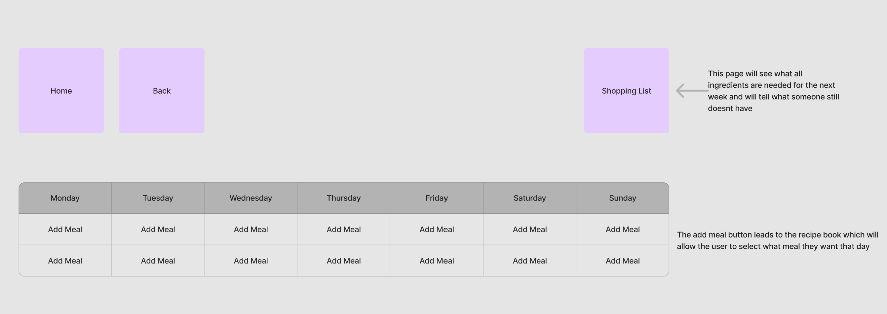